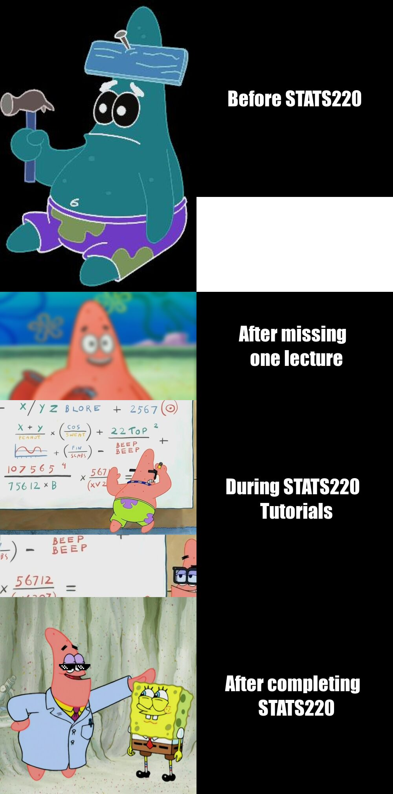

# Meme Information

- This ***meme*** was inspired by my personal experiences in university and looking my baby nephew watching Spongebob Squarepants at the time I started thinking about this assignment. 
- The motivation of creating this meme was to make something that other university students could relate to. 
- It is an adaptation of one of the most popular meme formats in internet history with a small *twist* on the structure to further emphesise each 'stage' of the meme.

Here is a meme I created using the R package [{magick}](https://cran.r-project.org/web/packages/magick/vignettes/intro.html).



**NOTE**: 
1. The first image has a space in the black square beside it to emphesise the lack of knowledge in R. 
2. The second image black square was scaled to be smaller than the others to show the slight increase in knowledge. 
3. The third image used a "bad" crop to show progress in learning. 
4. The fourth image used a "correct" crop using offset to show mastery of the function. 

Hopefully this lil' metaphor is not too confusing!

## CODE to create the meme:

```r
# Accessing the "magick" package
library("magick")

# Reading in images to be used in the meme while adding effects and cropping/scaling as necessary
dumb_patrick <- image_read("https://i.pinimg.com/564x/a0/10/51/a010513509364b4362e8660c3bc1c0c7.jpg") %>%
  image_scale(500) %>%
  image_negate()

lost_patrick <- image_read("https://a1cf74336522e87f135f-2f21ace9a6cf0052456644b80fa06d4f.ssl.cf2.rackcdn.com/images/characters/large/2800/Patrick-Star.SpongeBob-SquarePants.webp") %>%
  image_scale(500) %>%
  image_blur(10, 5)

learning_patrick <- image_read("https://preview.redd.it/kap0dlkydf941.png?width=640&crop=smart&auto=webp&s=d6bb91f72d44c2c51f263ac663bbae016e6b6146") %>%
  image_crop("500x500")

smart_patrick <- image_read("https://cdn.spongebobwiki.org/thumb/3/36/Patrick_SmartPants_main_image.png/1200px-Patrick_SmartPants_main_image.png") %>%
  image_crop("800x800+200") %>%
  image_scale("500x500")

sunglasses <- image_read("http://clipart-library.com/image_gallery2/Thug-Life-Sunglasses-PNG.png") %>%
  image_scale(80)

# Combining two images to use in the fourth square of the meme
sunglasses_smart_patrick <- image_composite(smart_patrick, sunglasses, offset = "+150+170")

# Adding black squares with annotation to be used in the meme
dumb_text <- image_blank(width = 500, 
                          height = 500, 
                          color = "#000000") %>%
  image_annotate(text = "Before STATS220",
                 color = "#FFFFFF",
                 size = 50,
                 font = "Impact",
                 gravity = "center")


lost_text <- image_blank(width = 500, 
                         height = 275, 
                         color = "#000000") %>%
  image_annotate(text = "After missing \n one lecture",
                 color = "#FFFFFF",
                 size = 50,
                 font = "Impact",
                 gravity = "center")

learning_text <- image_blank(width = 500, 
                             height = 500, 
                             color = "#000000") %>%
  image_annotate(text = "During STATS220 \n Tutorials",
                 color = "#FFFFFF",
                 size = 50,
                 font = "Impact",
                 gravity = "center")

smart_text <- image_blank(width = 500, 
                       height = 500, 
                       color = "#000000") %>%
  image_annotate(text = "After completing \n STATS220",
                 color = "#FFFFFF",
                 size = 50,
                 font = "Impact",
                 gravity = "center")

#Making each row of the meme
first_row <- c(dumb_patrick, dumb_text) %>%
  image_append()

second_row <- c(lost_patrick, lost_text) %>%
  image_append()

third_row <- c(learning_patrick, learning_text) %>%
  image_append()

fourth_row <- c(sunglasses_smart_patrick, smart_text) %>%
  image_append()

# Appending the rows together to create the final meme
meme <- c(first_row, second_row, third_row, fourth_row) %>%
  image_append(stack = TRUE)

# Saving the meme as a png file
image_write(meme, "my_meme.png")
```

**That's the end of the code!**

Here are the photos I used for the meme:
- [dumb_patrick](https://i.pinimg.com/564x/a0/10/51/a010513509364b4362e8660c3bc1c0c7.jpg)


- [lost_patrick](https://a1cf74336522e87f135f-2f21ace9a6cf0052456644b80fa06d4f.ssl.cf2.rackcdn.com/images/characters/large/2800/Patrick-Star.SpongeBob-SquarePants.webp)


- [learning_patrick](https://preview.redd.it/kap0dlkydf941.png?width=640&crop=smart&auto=webp&s=d6bb91f72d44c2c51f263ac663bbae016e6b6146)


- [smart_patrick](https://cdn.spongebobwiki.org/thumb/3/36/Patrick_SmartPants_main_image.png/1200px-Patrick_SmartPants_main_image.png)


- [sunglasses](http://clipart-library.com/image_gallery2/Thug-Life-Sunglasses-PNG.png)


